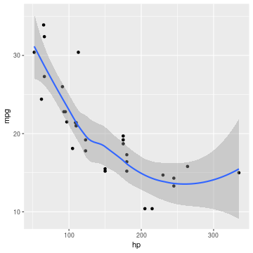

A reST document for knitr
=========================
.. note:: Ukázkový dokument z https://github.com/yihui/knitr-examples/blob/master/006-minimal.Rrst

This is a reStructuredText document. The input filename extension is ``Rrst``
and the output filename will be ``rst``. Here is how we write R code in
**knitr**:

.. sourcecode:: r
    

    options(width = 75)
    library(knitr)
    # do not use the sourcecode directive
    render_rst(strict=FALSE)
    
    # global chunk options
    opts_chunk$set(fig.width=5, fig.height=5)

More examples
-------------

A code chunk begins with ``.. {r label, options}``, and ends with ``.. ..``
(note the space in between). Optionally you can precede all R code with two
dots, e.g.

.. sourcecode:: r
    

    1+1

::

    ## [1] 2

.. sourcecode:: r
    

    set.seed(123); rnorm(10)

::

    ##  [1] -0.56047565 -0.23017749  1.55870831  0.07050839  0.12928774
    ##  [6]  1.71506499  0.46091621 -1.26506123 -0.68685285 -0.44566197

.. sourcecode:: r
    

    warning('do not forget the space after ..!')

::

    ## Warning: do not forget the space after ..!

Here is a plot:

.. sourcecode:: r
    

    library(ggplot2)

::

    ## Registered S3 methods overwritten by 'ggplot2':
    ##   method         from 
    ##   [.quosures     rlang
    ##   c.quosures     rlang
    ##   print.quosures rlang

.. sourcecode:: r
    

    qplot(hp, mpg, data=mtcars) + geom_smooth()

::

    ## `geom_smooth()` using method = 'loess' and formula 'y ~ x'

    Graf 2

Inline R code is like this: the value of pi is 3.1415927.
