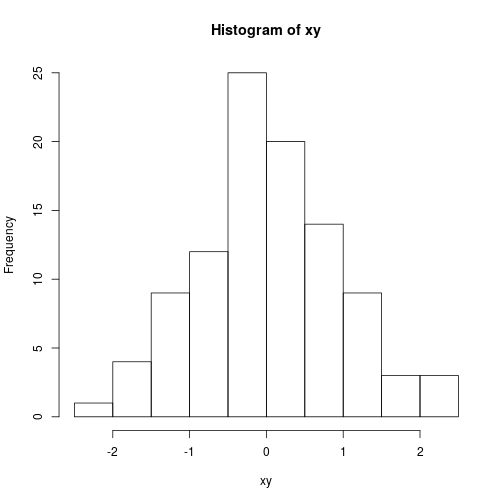

R test
======
Testovací dokument / pískoviště

.. sourcecode:: r
    

    library(reticulate)
    x = 42
    print(x)

::

    ## [1] 42

Tady bude nějaký r skript

.. sourcecode:: r
    

    1+1

::

    ## [1] 2

.. sourcecode:: r
    

    set.seed(123); rnorm(10)

::

    ##  [1] -0.56047565 -0.23017749  1.55870831  0.07050839  0.12928774
    ##  [6]  1.71506499  0.46091621 -1.26506123 -0.68685285 -0.44566197

.. sourcecode:: r
    

    x <- 44
    y <- 55
    x + y

::

    ## [1] 99

data na graf:

.. sourcecode:: r
    

    xy <- rnorm(100)
    xy

::

    ##   [1]  1.224081797  0.359813827  0.400771451  0.110682716 -0.555841135
    ##   [6]  1.786913137  0.497850478 -1.966617157  0.701355902 -0.472791408
    ##  [11] -1.067823706 -0.217974915 -1.026004448 -0.728891229 -0.625039268
    ##  [16] -1.686693311  0.837787044  0.153373118 -1.138136937  1.253814921
    ##  [21]  0.426464221 -0.295071483  0.895125661  0.878133488  0.821581082
    ##  [26]  0.688640254  0.553917654 -0.061911711 -0.305962664 -0.380471001
    ##  [31] -0.694706979 -0.207917278 -1.265396352  2.168955965  1.207961998
    ##  [36] -1.123108583 -0.402884835 -0.466655354  0.779965118 -0.083369066
    ##  [41]  0.253318514 -0.028546755 -0.042870457  1.368602284 -0.225770986
    ##  [46]  1.516470604 -1.548752804  0.584613750  0.123854244  0.215941569
    ##  [51]  0.379639483 -0.502323453 -0.333207384 -1.018575383 -1.071791226
    ##  [56]  0.303528641  0.448209779  0.053004227  0.922267468  2.050084686
    ##  [61] -0.491031166 -2.309168876  1.005738524 -0.709200763 -0.688008616
    ##  [66]  1.025571370 -0.284773007 -1.220717712  0.181303480 -0.138891362
    ##  [71]  0.005764186  0.385280401 -0.370660032  0.644376549 -0.220486562
    ##  [76]  0.331781964  1.096839013  0.435181491 -0.325931586  1.148807618
    ##  [81]  0.993503856  0.548396960  0.238731735 -0.627906076  1.360652449
    ##  [86] -0.600259587  2.187332993  1.532610626 -0.235700359 -1.026420900
    ##  [91] -0.710406564  0.256883709 -0.246691878 -0.347542599 -0.951618567
    ##  [96] -0.045027725 -0.784904469 -1.667941937 -0.380226520  0.918996609

graf:

.. sourcecode:: r
    

    hist(xy)

    Graf 1

Test python skriptu

.. {python}

x = 4
foobar = "foo"+"bar"
x*foobar

.. ..

